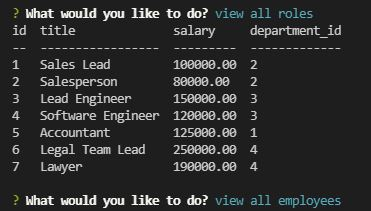

# Employee Tracker

## Description
Allows a user to track their company database within the command line. You can view and add departments, roles and employees, as well as updating them.

## Built With
* MySql
* Express
* Inquirer
* JavaScript

## Installation 
You can clone the code from my repo to your local computer or just go to the deployed application and use it for yourself.

## Usage

## Video
https://watch.screencastify.com/v/Bu0OXUkFUWktLeNRZdHx

## Questions
undefined
   
  Find me on GitHub 🏆: [Hunyeh](https://github.com/Hunyeh)
   
  ✉️ If any additional questions, email me @ : doringhunter@yahoo.com